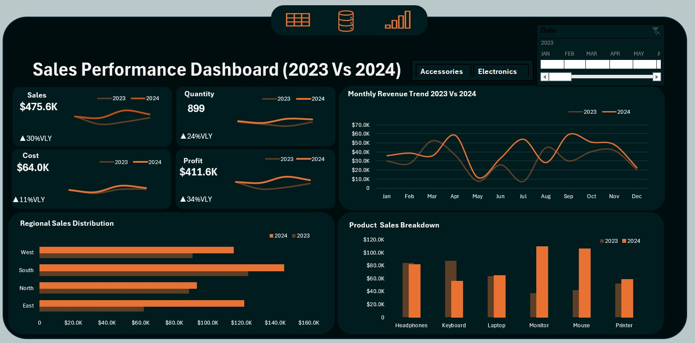

# -JandJ-Sales-Performance-Analysis-2023-vs-2024-
**Sales Performance Dashboard &amp; YOY Analysis (Excel Project)**

##  Introduction  
This project analyses two years of sales performance for a consumer electronics retail business operating in the technology accessories and hardware industry. The goal is to understand how the business evolved across 2023 and 2024 by examining sales, quantity, cost, profit, product categories, and regional performance.

The analysis was conducted to help the business gain clarity on **year over year (YOY) growth**, identify **top performing products**, and uncover **regional opportunities**. A dynamic Excel dashboard was developed to make insights accessible and interactive.

---

##  Problem Statement  
The business needs to understand **what drove the performance changes between 2023 and 2024**. While raw data existed, it lacked structure, visibility, and analytical depth.

This analysis aims to answer key questions such as:  
- Which KPIs improved or declined year over year  
- Which products contributed most to revenue growth  
- How sales varied across regions and time periods  
- Where strategic opportunities exist for expansion or optimization  

---

##  Data Sourcing  
The dataset was sourced from an internal Excel file containing transactional sales data.

- **Source:** Excel workbook  
- **Time Period:** January 2023 – December 2024  
- **Records:** Multiple monthly entries across products and regions  
- **Key Fields:** Date, Product, Region, Sales, Quantity, Cost, Profit  

---

##  Data Transformation & Cleaning  
The raw dataset was cleaned and prepared for analysis using Excel.

Steps included:  
- Removing duplicate entries  
- Handling missing values  
- Standardizing product and region names  
- Creating calculated fields for YOY growth, profit margin, and quarterly summaries  
- Structuring data for PivotTables and dashboard visuals  

---

##  Analysis & Measures  

### Key Calculations  
- **Total Sales** = SUM(Sales)  
- **Total Profit** = SUM(Profit)  
- **Profit Margin** = Profit / Sales  
- **YOY Growth** = (Current Year – Previous Year) / Previous Year  
- **Quarterly Aggregations** via PivotTables  
- **Best Product per Year** using MAX logic  

### KPI Summary  
| KPI | 2023 | 2024 | YOY |
|------|--------|--------|--------|
| Sales | $365.6K | $475.6K | **+30%** |
| Quantity | 724 | 899 | **+24%** |
| Cost | $57.5K | $64.0K | **+11%** |
| Profit | $308.1K | $411.6K | **+34%** |

---

##  Dashboard & Visuals  
 

The dashboard includes:  
- KPI Cards (Sales, Quantity, Cost, Profit)  
- Monthly Sales Trend (2023 vs 2024)  
- Product Sales Breakdown  
- Regional Sales Distribution  
- Quarterly Performance Charts  
- Slicers for Year, Product, Region  
- Timeline for month to month navigation  
- Navigation buttons linking Raw Data → Calculations → Dashboard  

A custom color palette was created using an image color picker to maintain visual consistency.

---

##  Insights & Findings  

### 1️⃣ Strong YOY Growth Across All KPIs  
Sales increased by **30%**, while profit grew even faster at **34%**, indicating improved operational efficiency.

### 2️⃣ Best Selling Products Shifted Between Years  
- **2023:** Keyboard ($87.0K)  
- **2024:** Monitor ($109.5K)  
This shift suggests rising demand for higher value hardware in 2024.

### 3️⃣ Regional Performance Highlights  
- **South** remained the highest performing region.  
- **East** nearly doubled its sales, showing the fastest growth.

### 4️⃣ Seasonal Trends  
Q3 and Q4 were consistently the strongest quarters, driven by back to school and holiday demand.

---

##  Recommendations  

###  1. Expand Inventory for High Growth Products  
Increase stock and marketing for monitors and mice.

###  2. Strengthen Presence in the East Region  
Targeted promotions or distribution expansion could unlock further revenue.

###  3. Leverage Seasonal Peaks  
Plan campaigns around Q3 and Q4 to maximize revenue.

---

##  Conclusion  
This project delivered a comprehensive, data driven view of the company’s sales performance across 2023 and 2024. The interactive Excel dashboard enables stakeholders to explore trends, compare performance, and make informed decisions around product strategy, regional focus, and seasonal planning.
